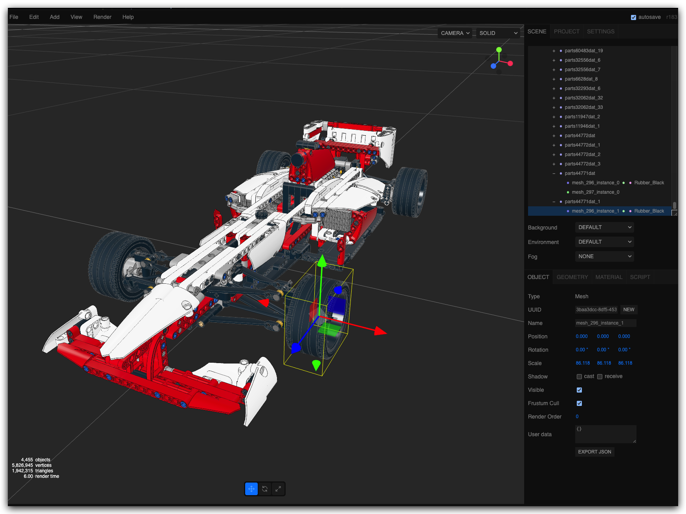

# mpd2glb

> A node.js CLI tool for converting LDraw models to GLTF's binary `.glb` format.

[](https://nodejs.org/en/download)
[](https://opensource.org/licenses/MIT)

**mpd2glb** reads `.mpd` LDraw models (see below for details) and generates a new GLTF binary model `.glb` with most similar features to the original LDraw model. 

The final `.glb` model will have the real-world dimensions of the original model, i.e. scaled to centimeters instead of LDUs.

## Features

- **Multi-platform** - Built on node.js with cross-platform dependencies
- **Automated conditional lines clean-up** - Avoids visual artifacts on the output model
- **Rescaling models to real-world size** - Converts LDU dimensions to real-world metrics: `.glb` models are real-size ones!
- **Compression support** - Supports `draco`, `meshopt` and `none` compression options
- **Remotes support** - Supports both local and remote: ldraw parts library and `.mpd` model
- **Optional LDraw library dependency** - Not required for packed input `.mpd` models, take a look at: 
    - [Packing LDraw Files](https://forums.ldraw.org/thread-28554.html)
    - [packLDrawModel.mjs packager](https://github.com/mrdoob/three.js/blob/dev/utils/packLDrawModel.mjs)

## Quick Start

### Prerequisites

I've built and tested this tool with the following (other versions could also work):

- [Node v24.11](https://nodejs.org/en/download)
- [npm v11.6.1](https://docs.npmjs.com/downloading-and-installing-node-js-and-npm)
- [Bun v1.3.10 (optional)](https://bun.com/)

### Building from source (no other way for now!)

```bash
git clone https://github.com/anteloc/mpd2glb.git
cd mpd2glb
npm install # install required node modules
npm run build # outputs: mpd2glb.mjs executable for bun
```

### Verify it works

```bash
npm main.mjs --help
# or
bun main.mjs --help
# or (bun only!)
bun mpd2glb.mjs --help
```

## Usage

This is a very simple tool, try it with a sample packed model (included):

```bash
node main.mjs -c draco -o f1-car.glb -l models/f1-car-packed.mpd f1-car.glb
# or (faster execution!)
bun mpd2glb.mjs -c draco -o f1-car.glb -l models/f1-car-packed.mpd f1-car.glb
```
To see the result, open the `f1-car.glb` model on an editor, like e.g. [Three.js Editor](https://threejs.org/editor/)



**NOTE:** This is the original LDraw model for the F1 car: [42000-1.mpd](https://raw.githubusercontent.com/anteloc/ldraw-lib/master/models/42000-1.mpd)

## Examples

```bash
# fully local: ldraw lib and model
node main.mjs -c draco -o 10129-1.glb -l path/to/ldraw path/to/models/10129-1.mpd

# mixed: ldraw lib (local) and model (remote)
node main.mjs -c draco -o 10129-1.glb -l https://raw.githubusercontent.com/anteloc/ldraw-lib/master/models/10129-1.mpd

# fully remote: ldraw lib and model
node main.mjs -c meshopt -o 10129-1.glb -l https://raw.githubusercontent.com/anteloc/ldraw-lib/master/ldraw  https://raw.githubusercontent.com/anteloc/ldraw-lib/master/models/10129-1.mpd

# packed model: no ldraw lib required
node main.mjs -c meshopt -o some-model.glb path/to/models/some-model-packed.mpd
```

## Notes

- The resulting `.glb` files can be imported and edited with other tools
- World-size models (centimetres): on some editors, they will look very small or even hard to find 
- Editable parts: individual parts can be handled independently.

