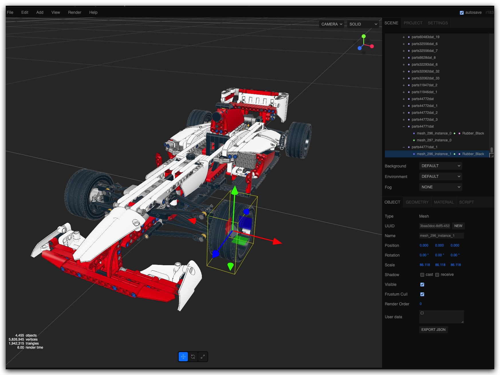

# mpd2glb

> A node.js CLI tool for converting LDraw models to GLTF's binary `.glb` format.

[](https://nodejs.org/en/download)
[](https://opensource.org/licenses/MIT)

**mpd2glb** reads `.mpd` LDraw models (see below for details) and generates a new GLTF binary model `.glb` with most similar features to the original LDraw model. 

The final `.glb` model will have the real-world dimensions of the original model, i.e. scaled to centimeters instead of LDUs.

## Features

- **Multi-platform** - Built on node.js with cross-platform dependencies
- **Automated conditional lines clean-up** - Avoids visual artifacts on the output model
- **Rescaling models to real-world size** - Converts LDU dimensions to real-world metrics: `.glb` models are real-size ones!
- **Compression support** - Supports `draco`, `meshopt` and `none` compression options
- **Colour remapping** - Replace any LDraw colour by another one at conversion time with `--map-color`
- **Part and submodel descriptions** - Every node gets a `description` custom property, readable in Blender and other editors
- **Remotes support** - Supports both local and remote: ldraw parts library and `.mpd` model
- **Optional LDraw library dependency** - Not required for packed input `.mpd` models, take a look at: 
    - [Packing LDraw Files](https://forums.ldraw.org/thread-28554.html)
    - [packLDrawModel.mjs packager](https://github.com/mrdoob/three.js/blob/dev/utils/packLDrawModel.mjs)

## Quick Start

### Prerequisites

I've built and tested this tool with the following (other versions could also work):

- [Node v24.11](https://nodejs.org/en/download)
- [npm v11.6.1](https://docs.npmjs.com/downloading-and-installing-node-js-and-npm)
- [Bun v1.3.10 (optional)](https://bun.com/)

### Building from source (no other way for now!)

```bash
git clone https://github.com/anteloc/mpd2glb.git
cd mpd2glb
npm install # install required node modules
npm run build # outputs: mpd2glb.mjs executable for bun
```

### Verify it works

```bash
npm main.mjs --help
# or
bun main.mjs --help
# or (bun only!)
bun mpd2glb.mjs --help
```

## Usage

This is a very simple tool, try it with a sample packed model (included):

```bash
node main.mjs -c draco -o f1-car.glb models/f1-car-packed.mpd
# or (faster execution!)
bun mpd2glb.mjs -c draco -o f1-car.glb models/f1-car-packed.mpd
```
To see the result, open the `f1-car.glb` model on an editor, like e.g. [Three.js Editor](https://threejs.org/editor/)



**NOTE:** This is the original LDraw model for the F1 car: [42000-1.mpd](https://raw.githubusercontent.com/anteloc/ldraw-lib/master/models/42000-1.mpd)

## Examples

```bash
# fully local: ldraw lib and model
node main.mjs -c draco -o 10129-1.glb -l path/to/ldraw path/to/models/10129-1.mpd

# mixed: ldraw lib (local) and model (remote)
node main.mjs -c draco -o 10129-1.glb -l https://raw.githubusercontent.com/anteloc/ldraw-lib/master/models/10129-1.mpd

# fully remote: ldraw lib and model
node main.mjs -c meshopt -o 10129-1.glb -l https://raw.githubusercontent.com/anteloc/ldraw-lib/master/ldraw  https://raw.githubusercontent.com/anteloc/ldraw-lib/master/models/10129-1.mpd

# packed model: no ldraw lib required
node main.mjs -c meshopt -o some-model.glb path/to/models/some-model-packed.mpd
```

## Colour remapping

`--map-color <from>,<to>` replaces one LDraw colour by another in the output `.glb`.
Each side is either a colour **code** or a colour **name**, as defined by the
`0 !COLOUR <name> CODE <code> ...` lines of your library's `LDConfig.ldr`.
Names are case-insensitive and spaces are interchangeable with underscores,
so `Dark_Pink`, `dark pink` and `DARK_PINK` all mean code `5`.

The option may be repeated; mappings are applied simultaneously, so
`--map-color 2,4 --map-color 4,14` turns green into red and red into yellow
without chaining the two.

```bash
# map by colour name
node main.mjs -l path/to/ldraw --map-color Green,Dark_Pink -c draco -o prop.glb models/55300.dat

# map by colour code
node main.mjs -l path/to/ldraw --map-color 16,26 -c draco -o prop.glb models/55300.dat

# mixed: colour code replaced by colour name, or viceversa
node main.mjs -l path/to/ldraw --map-color 16,Dark_Pink -c draco -o prop.glb models/55300.dat
```

Unknown colours abort the conversion; a colour the model does not actually use is
reported as a warning and the conversion continues. Packed models are supported
too — their own `0 !COLOUR` definitions are used when no `-l` library is given.

## Part and submodel descriptions

Nodes in the generated `.glb` carry the LDraw metadata as custom properties — `author`,
`buildingStep`, `category`, `colorCode`, `fileName`, `keywords`, `type` — and mpd2glb
adds one more: **`description`**, the human-readable name LDraw keeps on the first line
of every file and of every `0 FILE` block.

```
0 FILE 10265 - Rear Axle Adjustment.ldr
0 Rear Axle Adjustment            <-- becomes description = "Rear Axle Adjustment"
0 Name: 10265 - Rear Axle Adjustment.ldr
```

Descriptions are resolved in this order:

1. The model's own `0 FILE` block — used for the main model, for every submodel, and for
   the parts embedded in a packed `.mpd`. No parts library or index needed.
2. The part descriptions index, a tab-separated `<part file name>` / `<description>`
   file, for parts pulled from the LDraw library.
3. The file name itself, when the index is available but has no row for that part.

If no index is available at all, parts simply get no `description` property.

The bundled `part-descriptions-full.tsv` is picked up automatically: mpd2glb looks for it
next to `main.mjs` / `mpd2glb.mjs` first, then in the current directory. Use
`--descriptions <file>` to point at a different index:

```bash
node main.mjs -l path/to/ldraw --descriptions my-descriptions.tsv -c draco -o 10129-1.glb path/to/models/10129-1.mpd
```

The index is read once per conversion and kept in memory, so a model with thousands of
repeated parts costs a single lookup per distinct part.

## Notes

- The resulting `.glb` files can be imported and edited with other tools
- World-size models (centimetres): on some editors, they will look very small or even hard to find 
- Editable parts: individual parts can be handled independently.

